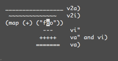
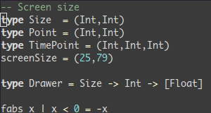
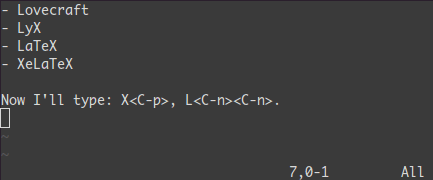
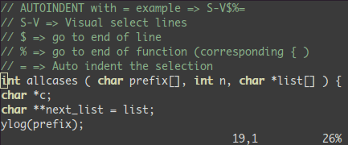
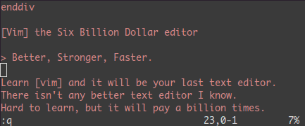

## Vim 安装
以Ubuntu下为例:
```
sudo apt-get install vim
```
For GUI
```
sudo apt-get install gvim
```
## 第一阶：三种模式
    + normal模式（默认模式）
    + insert模式（在默认模式下按i进入插入模式）
    + command模式（按ESC与:输入命令）
## 第二阶：简单使用

### 1. 简单的光标移动
    0：到本行行头
    $: 到本行行尾
    ^: 到本行第一个不是blank字符的位置（空格 tab 换行 回车 等）
    g_:到本行最后一个不是blank的位置
    jkhl:分别为上下左右移动
    /pattern:搜索pattern的字符串跳到相应位置 按n到下一个
### 2. 各种插入编辑方式
    a:在光标后插入
    o:在当前行后插入一个新行
    O：在当前行插入一个新行
    cw:替换从当前位置到最后一个单词结尾的字符
### 3. 拷贝/粘贴/删除
    dd:删除当前行并将当前行放入剪切板
    p:粘贴（在当前位置之后开始）（P为在当前位置之前开始）
    yy:拷贝当前行相当于ddP
### 4. Redo/Undo
    u：undo
    <C-r>:redo
### 5. 打开/保存/退出/改变文件(Buffer)
    :e <path/to/file> → 打开一个文件
    :w → 存盘
    :saveas <path/to/file> → 另存为<path/to/file>
    :x， ZZ 或 :wq → 保存并退出 (:x 表示仅在需要时保存，ZZ不需要输入冒号并回车)
    :q! → 退出不保存 :qa! 强行退出所有的正在编辑的文件，就算别的文件有更改。
    :bn 和 :bp → 你可以同时打开很多文件，使用这两个命令来切换下一个或上一个文件。
## 第二阶：提高效率
### 1.重复
#### (1) . ： (小数点) 可以重复上一次的命令
#### (2) N<command> ： 重复某个命令N次
#### (3) 示例
    - 2dd :删除两行
    - 3p：粘贴三次
    - 100hehe[ESC]：写下一百个“hehe”
    -.：重复上面的命令 写一百个“hehe”
    -3.：重复写三个“hehe”（不是三百个）
### 2.快速移动
#### (1)NG：到第N行
#### (2)gg：到第一行
#### (3)G：到最后一行
#### (4)单词移动
    1.w：到下一个单词开头
    2.e：到下一个单词结尾

#### (5)单词匹配
    1.%：匹配括号
    2.×与#匹配上一个（下一个单词）
### 3.组合命令
```
<start position><command><end position>

例如 0y$ 命令意味着：

0 → 先到行头
y → 从这里开始拷贝
$ → 拷贝到本行最后一个字符
你可可以输入 ye，从当前位置拷贝到本单词的最后一个字符。

你也可以输入 y2/foo 来拷贝2个 “foo” 之间的字符串。

还有很多时间并不一定你就一定要按y才会拷贝，下面的命令也会被拷贝：

d (删除 )
v (可视化的选择)
gU (变大写)
gu (变小写)
等等
```
## 第三阶：杀手级功能
### 在当前行上移动光标: 0 ^ $ f F t T , ;
```
0 → 到行头
^ → 到本行的第一个非blank字符
$ → 到行尾
g_ → 到本行最后一个不是blank字符的位置。
fa → 到下一个为a的字符处，你也可以fs到下一个为s的字符。
t, → 到逗号前的第一个字符。逗号可以变成其它字符。
3fa → 在当前行查找第三个出现的a。
F 和 T → 和 f 和 t 一样，只不过是相反方向。
dt" → 删除所有的内容，直到遇到双引号—— "。
```

### 区域选择 `<action>a<object> 或 <action>i<object>`
    action可以是任何的命令，如 d (删除), y (拷贝), v (可以视模式选择)。
    object 可能是： w 一个单词， W 一个以空格为分隔的单词， s 一个句字， p 一个段落。也可以是一个特别的字符："、 '、 )、 }、 ]。


```
假设你有一个字符串 (map (+) ("foo")).而光标键在第一个 o 的位置。

vi" → 会选择 foo.
va" → 会选择 "foo".
vi) → 会选择 "foo".
va) → 会选择("foo").
v2i) → 会选择 map (+) ("foo")
v2a) → 会选择 (map (+) ("foo"))
```

### 块操作: `<C-v>`
```
^ → 到行头
<C-v> → 开始块操作
<C-d> → 向下移动 (你也可以使用hjkl来移动光标，或是使用%，或是别的)
I-- [ESC] → I是插入，插入“--”，按ESC键来为每一行生效。
```

### 自动提示： `<C-n> 和 <C-p>`
在 Insert 模式下，你可以输入一个词的开头，然后按 <C-p>或是<C-n>，自动补齐功能就出现了……

### 宏录制： qa 操作序列 q, @a, @@
```
qa 把你的操作记录在寄存器 a。
于是 @a 会replay被录制的宏。
@@ 是一个快捷键用来replay最新录制的宏。
```
```
示例

在一个只有一行且这一行只有“1”的文本中，键入如下命令：

qaYp<C-a>q→
qa 开始录制
Yp 复制行.
<C-a> 增加1.
q 停止录制.
@a → 在1下面写下 2
@@ → 在2 正面写下3
现在做 100@@ 会创建新的100行，并把数据增加到 103.
```

### 可视化选择： `v,V,<C-v>`
```
前面，我们看到了 <C-v>的示例 （在Windows下应该是<C-q>），我们可以使用 v 和 V。一但被选好了，你可以做下面的事：

J → 把所有的行连接起来（变成一行）
< 或 > → 左右缩进
= → 自动给缩进 
```

```
在所有被选择的行后加上点东西：

<C-v>
选中相关的行 (可使用 j 或 <C-d> 或是 /pattern 或是 % 等……)
$ 到行最后
A, 输入字符串，按 ESC。
```

### 分屏: :split 和 vsplit.
```
下面是主要的命令，你可以使用VIM的帮助 :help split.

:split → 创建分屏 (:vsplit创建垂直分屏)
<C-w><dir> : dir就是方向，可以是 hjkl 或是 ←↓↑→ 中的一个，其用来切换分屏。
<C-w>_ (或 <C-w>|) : 最大化尺寸 (<C-w>| 垂直分屏)
<C-w>+ (或 <C-w>-) : 增加尺寸
```

## Tips
+ 上面是最常用的90%的命令。
+ 其在线帮助文档中你应该要仔细阅读的是 :help usr_02.txt.
+ 学习vim就像学弹钢琴一样，一旦学会，受益无穷。

英文原文:<http://yannesposito.com/Scratch/en/blog/Learn-Vim-Progressively/>
转载整理自:<http://blog.csdn.net/niushuai666/article/details/7275406>

