

**那些高科技手机看起来就像是空的，而与它们相比，我们的身体却又是那么错综复杂。**

---

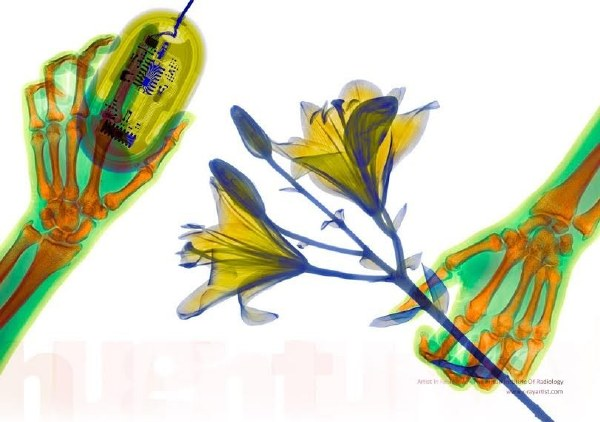

**但花儿依旧美艳惊人。**

---

　　这让我想起了在小说《三体》中作者描写人类第一次接触到三体人发来的第一个探测器时的情景：
>这时，人们发现了一个奇异的对比：机械臂显然是一个在设计上只重功能的东西，钢骨嶙峋，加上那些外露的液压设备，充满了繁杂的技术秉性和粗陋的工业感，而水滴则外形完美，这颗晶莹流畅的固态液滴，用精致的唯美消弭了一切功能和技术的内涵，表现出哲学和艺术的轻逸和超脱。机械臂的钢爪抓着水滴，如同一只古猿的毛手抓着一颗珍珠。水滴看上去是那么脆弱，像一只太空中的暖瓶胆，所有人都担心它会在钢爪中破碎。

---

　　回望我们的自然界，地球上的生物经过数以百万年的进化所达到的精巧程度要远远高于人类百年之中的科技水平。我们甚至还没能认识我们所处的自然界，具统计估算，我们所能认识的，即分类在编的或者至少有一个名字的或者发现过一个以上化石或残骸的生物种类数只占地球上生物种类总数的3%，也就是说有97%的在地球上生活过的生物种类我们是没有任何记录或者认知的，更别说有一个名字了，完全无从知晓它们的存在。
　　敬畏自然。

---

　　下面来听这首歌，背景音乐出自Yanni在2006年在拉斯维加斯（Las Vegas Strip）音乐会。前半部分给我的感觉就是宏大，一种前所未有的宏大。想想生物进化进程，曾经的数亿万年之间，生物进化的进程只能在漫长的时间里满步蹒跚地向前推进一点，想想5次生物大灭绝，生命的种子无不是一次又一次地从0开始，在一次次灾难后从头开始，在漫长的恶劣气候的侵蚀下一点点发芽，如同蹒跚学步地缓慢向前推进，一点一点地推进，地球上的每一种生物能走到今天，乃至人类的诞生已经实属一种幸运，想想广袤的宇宙，人类至今扫描了10万个星系,仍未发现外星超级文明，生命在这棵星球上的存在与繁荣在广阔的宇宙范围内仍然实属为一种幸运。

---

物种灭绝史| 时间|原因|后果
-----|----|----|-----
奥陶纪-志留纪之交大灭绝|4.39亿年前|全球气候变化|约有100个科的生物灭绝
晚泥盆纪弗拉斯期-法门期之交大灭绝|3.67亿年前|气候变冷、浅水中含氧量下降70%|物种消失海洋无脊椎动物损失惨重
二叠纪-三叠纪之交大灭绝|2.5亿年前|气候变化或天体撞击|物种数减少90%以上
三叠纪-侏罗纪之交大灭绝|2.08亿年前|起因不详|恐龙崛起
白垩纪-第三纪之交大灭绝|6500万年前|小行星或彗星坠落地球|恐龙时代在此终结

---

　　此时想想生物进化进程，再回头看看那张X光下照片中人类骨骼的形态，想像人类经过那么漫长的进化才走得到今天，是不是顿然生出一种敬畏之感呢？

---

　　正如同一首歌曲能给人不同的感觉一样，一千个读者就有一千个哈姆雷特，这首曲目同样让我想到了文明与历史的发展进程，历史学的并不好的我，在听到这首的时候总是有一种漫漫历史长河的感觉。仿佛如同自己就站在历史长河的风口上，回望整个文明的进程一样，面对的是历史的宏大和自身的渺小，想想滚滚历史长河凡人的生活只不过是其中一个小小的点缀浪花一闪而过，便汇入翻滚的大浪一同向东流去，不再回头。
　　回想我们文明发展的进程，在人类历史上，经过了一次次自然灾难的打击，一次次自我意识的觉醒，一次次科学认知的突破与突破，每一次向前步伐的迈进我们无不付出了惨重的代价，但文明的进程从未停止，文明的种子总是在苦难的废墟中一次次发芽，推进进程的前行。同生物进化的进程类似，文明的进程能延续到现在也实然不易。

---

---

　　总之一首歌曲能让人想到很多东西，这大概就是音乐独特的表现力。而对于音乐的解释，每一种匹配其实都可以和音乐符合，而一个好的音乐家就是能善于将这些所有情感激发出来的人。像音乐这种东西不像图形图像或者现在大多采用的视频一样，不能被人直觉地感知，而更多地是一种无形，无形的东西才是设计最精妙的东西，因为人在体会文字和音乐这类无形的东西的时候，使用的却是现今世界上性能最强劲的显卡－人的想像力。

---

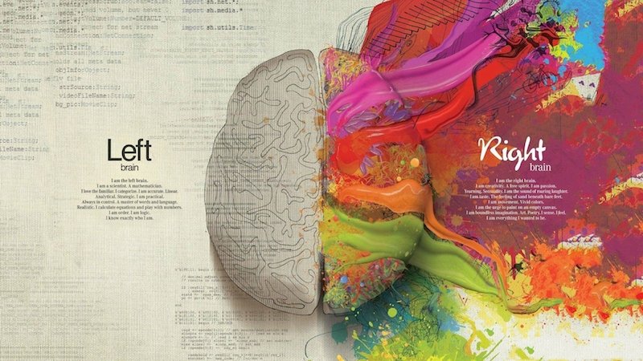

---

　　笔者时常在想一些终极的问题，想着地球上的每一个生物从诞生之日开始就注定了迟早的灭亡，而生物灭亡之后会给这个世界这个星球留下点什么？在地球上存活过的生物数不胜数，但是貌似我们并没有发现过这么多的生物中给这个星球留下过的存话的痕迹。顶多是少数的远古时期的生物留下的几块化石而已。如此巨量的生物尚且留下不了任何痕迹，何况我们微乎其微的人类个体的存在呢，恐怕也是一样。回想从人类历史上也仅仅有极个别的仅限于近代的有名的人物，顶多留下一点文献资料而已，这便是全部的记录了，而剩下的有着庞大数量的在这个星球上存活的人们却是“无迹可寻”的，更不用说历史更早时期的那些存活过的人们更是毫无痕迹的。于是便有了对生命的感慨，存活在世上的每个人也的的确确是“活着走一遭”而已，再无其他。
　　如此结论便让我想起了余华在小说《活着》中所表达出的那句思想：“人大可不必刻意追求什么意义，活着本身，便是最大的意义。”现在想来，这样的思想其实是很深刻的。

---

　　最后，再欣赏几幅天文图片 ：D
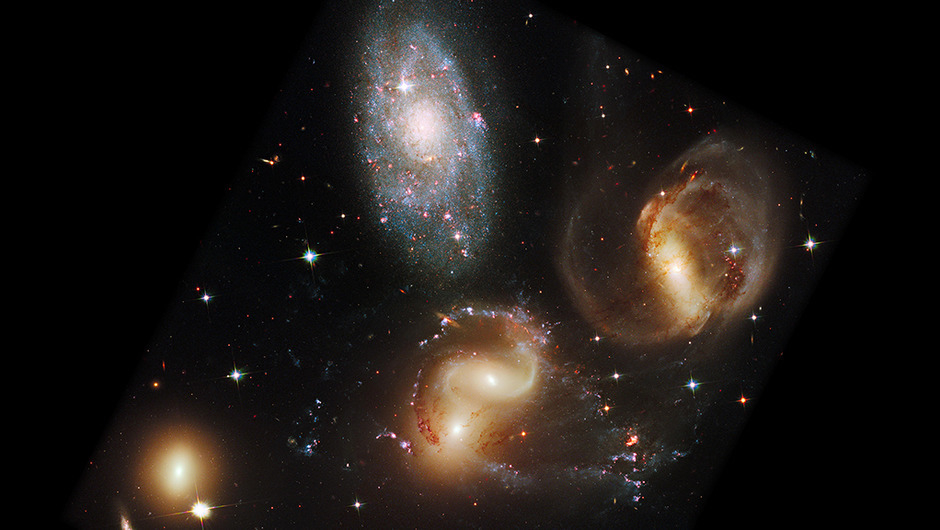
**图片注：斯蒂芬五重星系。图片来源：NASA 由哈勃空间望远镜拍摄**
斯蒂芬五重星系，是5个看起来似乎挤成一团的大星系，不过其中有一个星系是打酱油的，跟其他4个星系相距甚远，只是刚好出现在同一个方向上。在哈勃拍摄的这张照片里，很容易把两者分开。那个偏蓝的星系，距离地球仅4000万光年，而其他偏红的星系，距离地球约有2.9亿光年。
(科普：为什么离我们远的星系看起来要红一些？由于宇宙在膨胀（而且有可能是在加速膨胀），导致离我们越远的星系远离我们的速度越快，由相对论效应，在我们看来其发出的光的波长变长，表现为可见光波段光谱的谱线朝红色端整体平移，即红移。离我们越远的星系其红移效应越明显。在1912年开始的观测，维斯托.斯里弗发现绝大多数的螺旋星云都有不可忽视的红移。然后埃德温.哈勃发现这些星云（现在知道是星系）的红移和距离有关联，也就是哈勃定律。这些观察在今天被认为是造成宇宙膨胀大爆炸理论的强而有力证据。图为哈勃望远镜升空25周年精选图集中的一张。）

---

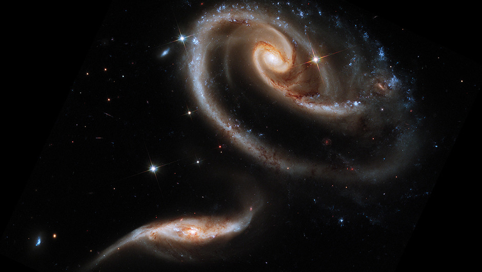
**图片注：相互作用星系Arp 273。图片来源：NASA 由哈勃空间望远镜拍摄**
哈勃拍摄的Arp 273，展示了两个由于相互之间的引力影响而变得形状扭曲的旋涡星系。较大星系的最外侧旋臂，被拉成了一道星环，缠绕在星系周边。这一特征暗示，较小的星系曾经从较大的星系中穿过。

---

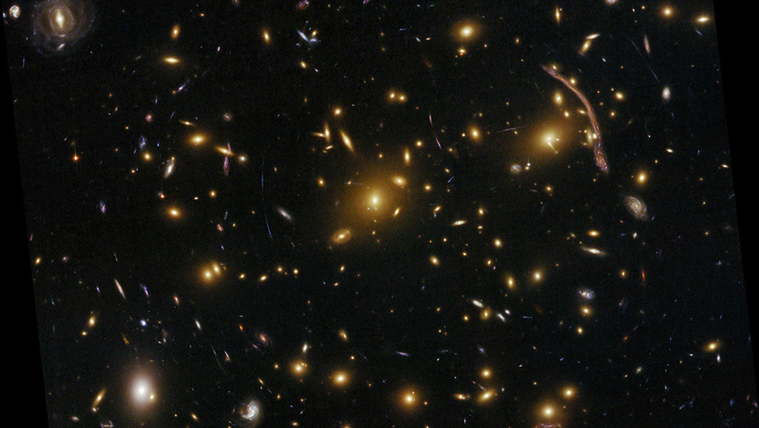
**图片注：星系团阿贝尔370。图片来源：NASA 由哈勃空间望远镜拍摄**
在哈勃拍摄的这张星系团阿贝尔370的照片中，可以看到许多扭曲的光条。这些都是星系团背后更遥远的星系，它们的影像被阿贝尔370的引力扭曲了。这是天文学家第一次在星系团中看到如此强烈的引力透镜效应。利用这些扭曲的影像，天文学家能够计划星系团的质量，以及物质在其中的分布。研究显示，这个星系团是由两个较小的星系团合并而形成的。
(科普：什么是引力透镜效应？引力透镜效应是爱因斯坦的广义相对论所预言的一种现象，由于时空在大质量天体附近会发生畸变，使光线在大质量天体附近发生弯曲（光线沿弯曲空间的短程线传播）。如果在观测者到光源的视线上有一个大质量的前景天体则在光源的两侧会形成两个像，就好像有一面透镜放在观测者和天体之间一样，这种现象称之为引力透镜效应。1979年，天文学家观测到类星体Q0957+561发出的光在它前方的一个星系的引力作用下弯曲，形成了两个一模一样的类星体的像。这是人类第一次观察到引力透镜效应。）

---

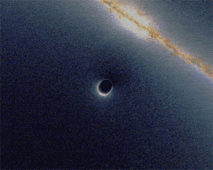
**图片注：黑洞的引力透镜效应。图片来源：Wiki**

---

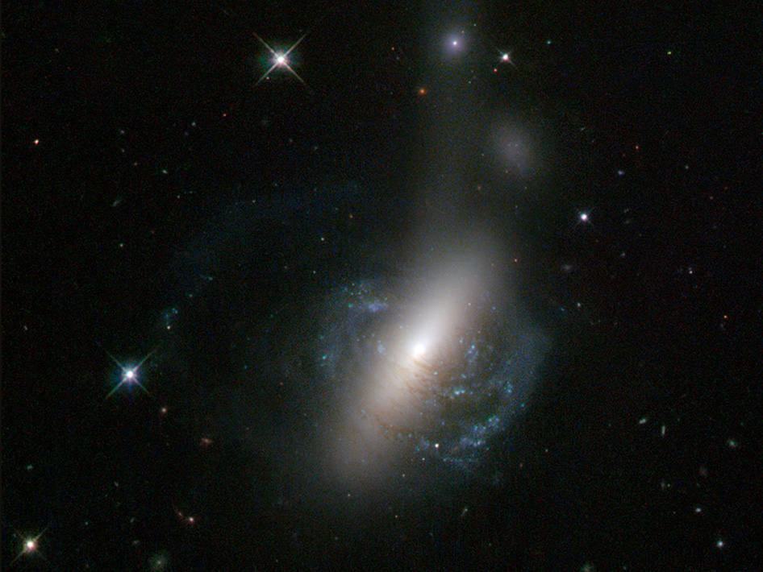
**图片注：两个正在发生剧烈碰撞的星系 图片来源：NASA**
这幅来自NASA哈勃太空望远镜的照片记录了两个正在发生碰撞的星系之间的壮观一幕，碰撞双方分别为一个螺旋星系以及一个透镜状星系。图中周围的几颗亮度惊人的星体这是这次碰撞的产物，它们被天文学家编号为ESO 576-69。

---

**图片注：超新星四重像 图片来源：NASA**
星系和星系团生成的遥远超新星四重像，2014年11月由哈勃空间望远镜拍摄。这其实是一个超新星的影像，由于重力透镜效应，分裂成四重影像。

---

**图片注：归程 图片来源：NASA**
日出时分的归程，3月12日三名宇航员从空间站乘坐联盟号飞船返回母星地球的高清图，有种地心引力即视感。

---

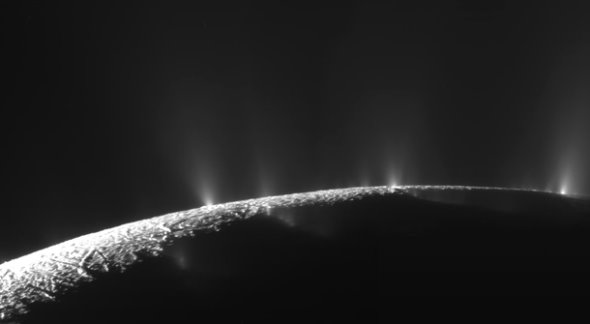
**图片注：土卫二美丽的羽毛**
“卡西尼”号探测器就开始环绕土星运转，并传回了一系列令人难以置信的精彩图片，也帮助人类从此改变了对土星的看法。此外，“卡西尼”号探测器还发现了关于土星卫星的大量秘密。其中，土卫二也是“卡西尼”号探测的重要目标之一。通过“卡西尼”号，人类对土卫二有了进一步的认识。它不再只是一个直径只有500公里的冰球。在“卡西尼”号发回的土卫二特写中，人们不仅仅清楚地发现了土卫二南极的“虎纹”，还从“虎纹”区观测到许多巨大的液体喷泉。这些喷泉以每小时数百公里的速度向空中喷射大量的水。从地平线的角度观察，这些喷泉在阳光的照射下好似一根根羽毛。

---

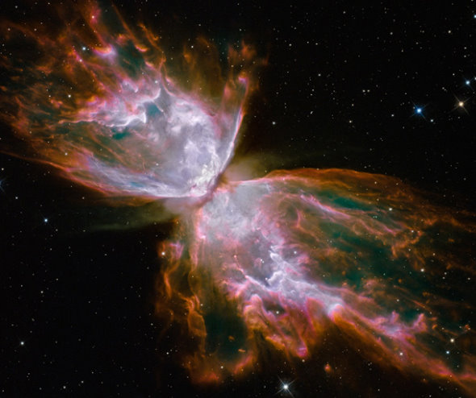
**图片注：蝴蝶星云 图片来源：Wiki**
本图是“哈勃”太空望远镜修复后所拍摄的首批深空照片之一。图中显示的是编号为“NGC 6302”的蝴蝶星云，它是一个行星状星云。“蝴蝶”的“翅膀”延伸的距离有2光年远，它是由高温气体组成，因此看起来光彩耀人。这些气体是由一颗距离地球所在的银河系约3800光年的垂死恒星所喷射出来的。气体以每小时60万英里(约合每小时96.6万公里)的速度被释放到太空当中，于是就形成了这一巨大、精致的“蝴蝶翅膀”结构。本图是由“哈勃”太空望远镜上新安装的广角相机三号所拍摄，其中红色部分是氢气，蓝色和绿色部分是氧气，青绿色部分则是氦气，而氮气和硫磺等物质则呈现的也是红色。

---

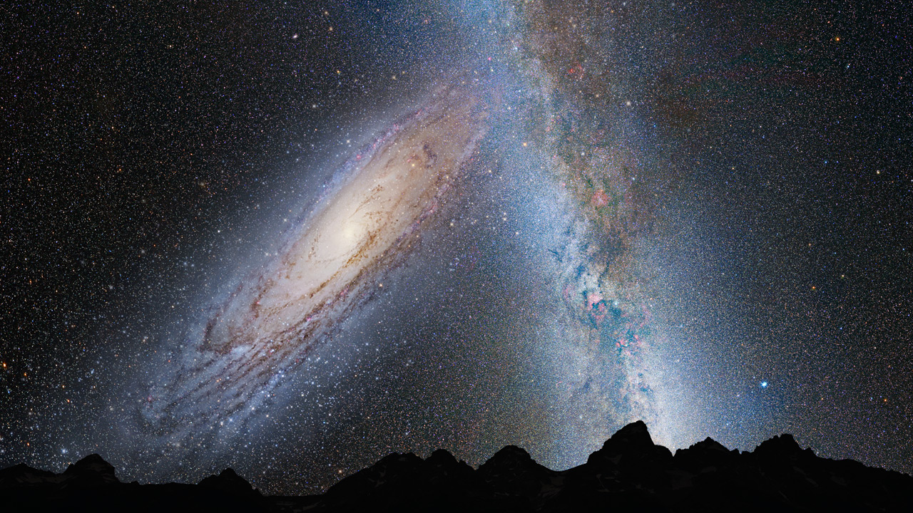
**图片注：约37.5亿年后仙女座与银河系星系的夜空图 图片来源：Wiki**
仙女座星系-银河系碰撞是预计三十亿年后，在本星系群中两个最大的成员星系──银河系和仙女座星系之间发生的星系碰撞。在星系碰撞的有关模拟研究中仙女座星系-银河系碰撞常常被用来当作此类现象的范例。事实上，在这种星系碰撞中星系中所包含的恒星等天体并不会真的发生物理上的碰撞接触，因为星系本身是非常弥散的——作为距离太阳最近的恒星，比邻星与地球间的距离也有太阳直径的三千万倍之遥。（如果太阳按比例缩小为一枚25美分硬币大小，那么比邻星则在700千米之外。）如果这个理论正确，那么在大约三十亿年后仙女座星系内的恒星与气体将能够在地球上用肉眼看到。如果仙女座星系与银河系发生了碰撞，两个星系将在大约七十亿年后最终合并为一个更大的椭圆星系。对于这一合并后星系的命名有多种提议，其中最广为接受的是“Milkomeda”，亦即“银河系”（Milky Way）和“仙女座星系”（Andromeda）的英文合称。

---

<video src="g.mp4" controls="controls" preload="auto" /></video>

**图片注：两星系相撞过程 来源：Wiki**
上面的无声视频片段为NASA使用计算机模拟的两星系相撞的过程，注意视频中相撞过程中的1秒相当于500万个地球年。

---
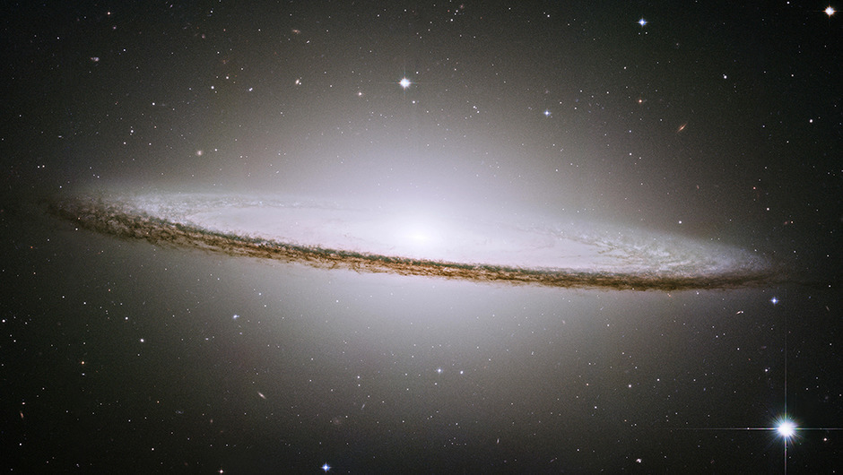
**图片注：草帽星系。图片来源：NASA**
草帽星系宽约5万光年，距离地球近2900万光年。借助哈勃望远镜，天文学家在这个星系的中心找到了一个超大质量黑洞，质量相当于太阳的10亿倍，是邻近宇宙中最大的黑洞之一。哈勃望远镜还在草帽星系里发现了2000多个球状星团，是银河系球状星团数目的10多倍。

---

**图片注：旋涡星系NGC 1300。图片来源：NASA**
NGC 1300是棒旋星系的典型代表，它们的旋臂并非源自星系的中心，而是从一条直棒的两端向外延伸。最近有观测表明，我们的银河系也是一个棒旋星系。哈勃拍摄的这张照片，展示了棒旋星系中前所未见的细节特征。借助哈勃望远镜，天文学家发现今天的旋涡星系约有65%拥有棒状结构，而在70亿年前，这个比例只有20%。

---

**图片注：星系M83。图片来源：NASA**
尽管比我们的银河系小得多，M83产生恒星的速度却比银河系快得多，因而被称为星暴星系。这个旋涡星系的旋臂上点缀着许多粉色的氢气云团，那里是新的恒星正在诞生的地方。借助哈勃望远镜，天文学家调查了M83中恒星的诞生、演化和消亡。

---

　　借用智子的那句：“宇宙很大，生活很大。”
　　宇宙到底有多空旷？如果把整个太阳系都收缩到手掌心里，那么离我们最近的比邻星在300米以外的公园里，除此之外，从手掌心到300米之外的那个点，那么广阔的空间，什么也没有。而从微观上也是类似的空旷，如果你把想象把一个原子核扩大到网球的大小，那么小小的电子会小如一粒尘埃，它的轨道在距离网球 1 公里处。这些数字是相当令人吃惊的，因为对固体物质而言，我们很难感觉到它实际是空的。假如在整个欧洲的范围里只扔两只苍蝇，苍蝇在欧洲的密度也比银河系里恒星的密度大得多得多。而银河系里的这一切，还只是我们这个宇宙的一个很一般的小角落里的故事。
　　对于我们来讲，其实最本质的不是数字有多少个零，也不是时间有多么漫长久远，相比之下，其实更重要的是**在感受自己的渺小之后，也并不会觉得人生因为太短暂而没有意义，反而会更珍惜这宝贵的一瞬。**在本篇最后的最后，笔者就以下面这个视频作为本篇的结尾吧，如果有兴趣的话笔者建议把乐曲听完再点开下面的视频吧。

<video src="f.mp4" controls="controls" preload="auto" /></video>

---

**当然，还有最重要的，谢谢观看！**

<audio src="e.mp3" controls="controls" autoplay /></audio>

本篇笔者所选取的背景音乐为**Yanni**于拉斯维加斯音乐会之中的倒数第三首和倒数第二首，被收录于其**《Yanni Live! The Concert Event》**专辑，前者曲名为**Prelude**，中文译为前奏，后者曲名**Nostalgia**，中文译做追思。本篇其中图片的介绍部分参考自维基百科和互联网。

<!-- 参考: -->
<!-- http://jandan.net/2015/05/09/fascinating-x-rays.html -->
