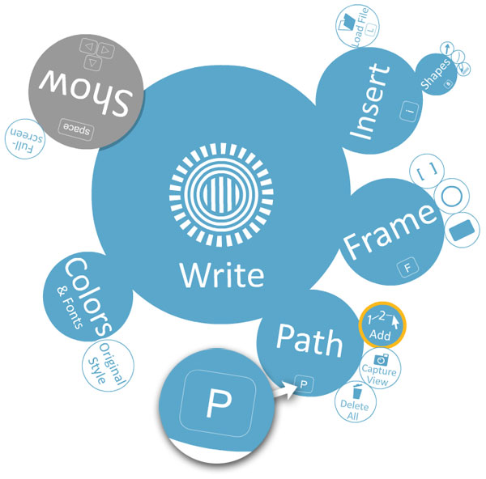
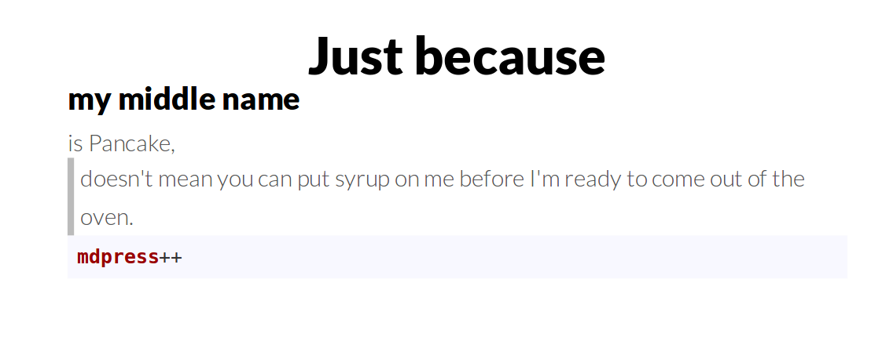

## 引言
　　做演示最常见的莫过于PPT了，但是制作一个PPT我们有50%的精力都花费到了诸如图片位置，文字布局以及其他元素的整体布局以及每张之间的动画过渡这些外观的规划上，而剩下50%的精力专注于所演示的内容。我们的理想目标是尽可能地将多数的精力花费在内容本身上而并非所采用的形式上。并且PPT还有同一文件在不同机器甚至不同Office版本上展示都有所不同的神奇“特性”，显然我们有更好的选择。

　　[Prezi](http://prezi.com/)号称是PPT的杀手，仅仅依靠简单的步骤你就可以通过Prezi做出比较炫酷和个性的通过动画视角来回切换的PPT演示，但是Prezi有以下几个缺点：
* Prezi基于Flash技术，由于近年来Flash的高功耗和诸多问题，Flash应该属于要被淘汰掉的技术，个人更倾向于html5的发展。
* Prezi为收费软件，免费版本做的展示必须公开在网站上展示，这样无疑会有隐私问题。
* Prezi依赖Adobe Air，只有Windows以及MacOS版本，在移动设备上不能展示。

## 简介
　　html显然是可以呈现内容最为丰富标记语言，而Markdown是近些年来流行起来的一种可以快速上手，非常容易就能写出来条理结构清晰的文档的一种纯文本文档格式。能否用Markdown写展示内容，然后直接转化为演示幻灯片呢？答案是可以的！它就是mdpress。
　　mdpress的优点就在于你可以依靠Markdown快速制作出比较炫酷的演示幻灯片，演示者只用写好内容和标记每张幻灯片的位置其他都由程序来完成生成幻灯片以及幻灯片之间的动画视角镜头切换，非常快捷，而且可以最大程度地使演示者只关注于演示内容本身而不用操心其他的事情，程序都可以帮你做好。


## 什么是mdpress
　　mdpress([Github](https://github.com/egonSchiele/mdpress))基于impress，impress([Demo Here](http://bartaz.github.io/impress.js))提供了一套包含有html以及Javascript的模版，你可以利用这套模版利用html制作出具有Prezi的动画效果及风格的演示文档，只需一个浏览器就可以到处演示你所制作的内容，但是impress只是一套模版，你要想制作出你的内容需要有一定的前端开发经验和知识，这样对于多数人来说显然不够方便。
　　mdpress就是这样一种工具，使用它你只用写出Markdown文本格式的文档，它就可以帮你转换成基于impress.js模版的演示文稿，而且在任意现代的浏览器上都能演示，并且mdpress还提供了多种模版格式和风格供你选择，并且如果你有一定CSS知识，完全可以定制你自己喜欢的风格，非常方便。


## MDpress的安装

### 方法一：使用Ruby的包管理器gem安装
MDpress工具基于Ruby开发，使用gem安装的命令如下：
```bash
sudo apt-get install ruby ruby-dev
sudo gem install mdpress
```
### 方法二：使用各发行版的包管理器直接安装
注意在Ubuntu 14.04以上版本以及Debian的Testing官方源中已经打包了相应的安装包，只需执行下面命令即可：
```bash
sudo apt-get install mdpress
```
其他Linux发行版请自行查看官方源里面有没有相应的包，没有请参照方法一安装。
## MDpress的使用
### 第一个演示文档
新建first.md文件，写入以下内容
（书写格式为Markdown文本格式,Markdown基本规则格式请参照[此图](如何做geek范的presentation/mdpress4.png)）
```markdown
# Chicken Chicken Chicken
## By Chicken
```
然后保存，终端中在当前目录执行以下命令即可：
```bash
mdpress first.md
```
然后用浏览器打开所生成的first文件夹内的index.html可查看效果。

### 添加多张幻灯片

上面的只有一张幻灯片，要想添加多张幻灯片只需用`---`隔开即可，如下：

```markdown
# Chicken Chicken Chicken
## By Chicken

---
# 第二张
## 副标题
### balabalabala...

---
# 第三张
- 列表1
- 列表2
```
用浏览器查看时按空格是下一张，左右方向键也可以上一张下一张切换。
### 转换动画
你会发现上面虽然实现多张了，但是根本没有什么动画嘛，你讲的都是骗人的！别急，下面你只用定义每张幻灯片的坐标位置，就可以自动切换来切换去啦。
在`---`下面加入`= data-x="1000"`，例如：

```markdown
# Chicken Chicken Chicken
## By Chicken

---
= data-x="1000"
# 第二张
## 副标题
### balabalabala...

---
= data-x="1000" data-y="1000"
# 第三张
- 列表1
- 列表2
```

### 定义缩放

同样在`---`下面加入`= data-scale="2"`可以定义幻灯片的缩放级别，完成缩放变换动画，例如：
```
# Chicken Chicken Chicken
## By Chicken

---
= data-x="1000"
# 第二张
## 副标题
### balabalabala...

---
= data-x="1000" data-y="1000" data-scale="2"
# 第三张
- 列表1
- 列表2

---
= data-x="5000" data-y="5000" data-scale="5"
# 第四张
## 副标题
###  三级标题

---
= data-x="1000" data-y="3000" data-scale="1"
# 嘿嘿
```

### 定义旋转
`= data-rotate="60"`可以定义幻灯片的旋转角度，完成旋转变换动画，例如：
```
# Chicken Chicken Chicken
## By Chicken

---
= data-x="1000" data-rotate="60"
# 第二张
## 副标题
### balabalabala...

---
= data-x="1000" data-y="1000" data-scale="2" data-rotate="90"
# 第三张
- 列表1
- 列表2

---
= data-x="5000" data-y="5000" data-scale="5" data-rotate="90"
# 第四张
## 副标题
###  三级标题
```
([Final Demo Here](/lab/mdpress))


**可以使用的属性有：**
* data-x, data-y, data-z: positioning
* data-rotate-x, data-rotate-y, data-rotate-z, data-rotate: rotation (data-rotate and data-rotate-z are exactly the same)
* data-scale: scale
* id: used as the slide link. For example, if you use id=intro, you can link to that slide using index.html#/intro.

另外使用data-x,data-y,data-z和data-rotate-x, data-rotate-y, data-rotate-z这些可以实现3D效果，自己摸索着玩吧！
## Latex数学公式支持
MDpress支持数学公式的渲染(内部使用的[Mathjax](http://www.mathjax.org/))
示例test.md:
```markdown
# Teoria de dependência estatística, Cópulas e teoria de informação
### Rafael S. Calsaverini

---
= data-x="1000" data-scale="2"

## Dependência estatística
* Independência estatística: $P(x,y) = P(x)P(y)$, ou: $$P(x|y) = P(x)$$
* Dependência completa:
    $$P(x|y) = \delta(x - F(y))$$
		* Quanto mais posso saber sobre $X$ conhecendo $Y$? $P(X|Y)$

---
## Correlação

* Módulo usualmente empregado como medida de dependência estatística.
    $$|\mathrm{Corr}(X,Y)| = \left| \frac{E[XY] - E[X]E[Y]}{\sigma[X]\sigma[Y]}\right|$$
		* Correlação é problemática:
		* $\mathrm{Corr}(X,Y) \ne \mathrm{Corr}(f(X), g(Y)) $, em geral;
---
= data-x="1000" data-scale="2"
## Medidas de dependência

* Desideratos para uma boa medida de dependência <sup><a href="#frenyi" id="renyi">[1]</a></sup>:
    * $M[X,Y]$ é um funcional da distribuição conjunta;
---
= data-x="1000" data-scale="2"
#Latex
$$e^{\imath\pi} = -1$$
```
注意:Latex公式中的`-`可能和Markdown的斜体语法引起冲突，加\转义即可：
```latex
$a_x$ # wrong, x will be italic
$a\_x$ # right, x will be a subscript
```
## 多种风格主题
使用`mdpress -l`可列出多种主题，使用`mdpress -s 主题名称 example.md`可指定转换时所用的主题，默认则使用默认主题。你可以定制自己的风格。

## Metadata支持
支持Metadata的文本格式，例如：
```yaml
---
title: All about chicken
---
```
## 结束语
　　总之，MDpress是一个非常好用的演示文稿制作工具，而且此种方法具有非常灵活的可定制性，对于经常用Markdown写文档的以及经常做演示的是个非常不错的选择，而且条理会很清晰。并且演示效果也是相当的炫酷！
**参考：**
(http://egonschiele.github.io/mdpress/)
