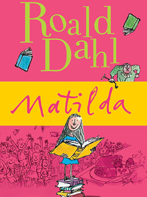
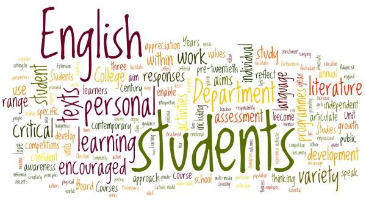
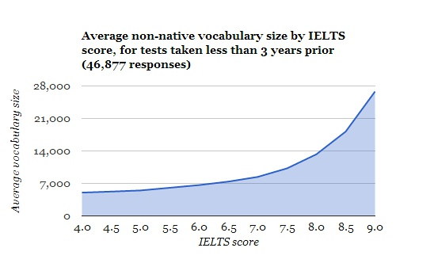
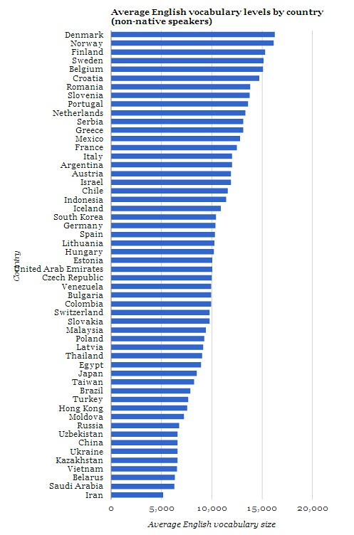

<div id="board"></div>

## 引言
　　本篇总计一下经过参阅了多人经验以及多次比较所得出的笔者所认为的最好的并且可行英语学习体系，同时也是笔者所制定的一个英语学习的计划。
　　**注意：本篇仅仅探讨如何提高英语水平，并不针对任何一个英语考试；提升英语水平和准备突击英语考试在笔者看来是两个不同的体系。**
　　下面开始正文部分，本篇分为听说读写4个部分依次讨论。
>**基本原则：正确的输入才有正确的输出。**

    * 基本原则推论一：大量的输入才有大量的输出。
    * 基本原则推论二：听，读分别可以看做说，写作为输出的输入。
    * 基本原则推论三：输出和输入同等重要。
    * 基本原则升华推论：“浸入式学习”，即以英文的方式思维。


---

## 词汇量

### 总述
　　词汇量是听说读写四部分的基础，没有词汇量空谈听说读写没有任何意义。词汇量的积累是一个量变到质变的漫长过程，需要**不间断的，恒久持续的，每天少量的**摄入过程。总而言之，它是一个长期的过程，事实证明，仅仅凭借短期之内的每天大量的摄入是没有意义的，摄入停止之时便是大规模的遗忘开始之时。
　　同时，一个陌生的单词从第一次遇到以后需要**多次的，重复的，间隔时间越来越长的**摄入才能最终形成记忆，短期内的记忆也是没有意义的。记忆过程的本质就是重复。

---

### 学习工具
　　关于学习工具，目前的智能手机上已经有很多可以帮助记忆单词的APP可以使用，笔者选取其中用户量多的几款分别进行分析（`通用功能不再赘述，仅讨论各自特点`）。

---

* `扇贝单词`：它会复习你之前背过的单词，循环记忆，根据例句回忆意思，阅读材料划词释义加入生词，透析法雏形。
* `开心词场`：沪江出品，词书比较丰富，和沪江网校出品的课程捆绑，Game模式。
* `云词`：单词的发音，图片，解释很全，闪卡形式。
* `拓词`：简单粗暴，背单词仅仅给出意思。
* `百词斩`：把音形义结合起来，通过图片辅助记忆，但一些图片比较无厘头。
* `乐词`：单词附有名师讲词的视频片段。
* `多邻国`：适合初学者，严格意义上并不是一个背单词的软件。
* `Super memo`：强大的后台算法，需要折腾。
* `有道词典的生词本`：适合水平较高，平时遇到生词较少的用户。
* `背单词online`：软件运行流畅，界面简单大方，没有广告，多次重复。
* `迅词`：只有“知道”和“不知道”两个选项，简单直接。

---


---

　　当然还有其他的知名的不知名的很多很多笔者在此就不再举例子了，说了这么多，在笔者看来，上面举例子的，当然包括一些没有举出来作为例子的，它们都是同一类型的软件，即**辅助建立起英文单词与汉语解释在脑海里的一一对应关系**。当然那个`百词斩`是一个特例，算是一个比较有特色的软件，它并非采用仅仅汉语文字解释的方式，而且还通过图像建立对应关系，思路非常好，但是经过笔者使用发现仅仅通过一两幅图片是不能完整地表达单词所反映的意思的。当然也有一些例如`扇贝`是用英英解释而并非仅有汉语解释，但是这也不外乎建立一种对应关系的范畴。笔者在这里要说的是仅靠建立一种对应关系是很难真正意义上提高词汇量的（当然不可否认的是背单词能在**短期**内应付英文考试的要求，当然这不在本文的讨论范围之内），因为背单词的问题都是一样的，**容易形成记忆孤岛**。有以下几点论证：

---

* 每个单词都有不同释义，背词典或者背词汇书首先你不知道哪个释义常用，其次你没办法全部记住。
* 孤立上下文没有语境的单词全部都是死的，无用的单词。
* 仅仅建立一种对应关系但仍然不知道怎么用。
* 即便记住了大量的单词后在口语表述和写作当中仍然不太可能会用背过的单词，原因第一在于不知道怎么用，第二在于在实际输出中在脑海中并不能涌现出来这些单词，因为它们在一个`记忆孤岛`上。
* 总之，记忆对应关系的单词仅仅停留在“认识”阶段，而并不能进阶到“使用”阶段，因此对应付考试有用（短期）。

---

下面举出两个经典例子：
>比如：terrible，dread，dreadful，horrible，frightful，awful……这些都解释成“可怕的”，但是不在真实的语境中，根本没法理解他们的区别，背了也是白背。
>比如proliferation这个词，字典给出了“n. 增殖，扩散”的释义，你也背下来了。但是在想表达“过去几个月内快餐遍地开花”的时候，你是否会说 the last two months have seen a proliferation in fast food，还是只懂得说 xxx increased rapidly (sharply)？

---

### 过渡性建议
　　当然，上面的说法在早些时候就有人提出来了，于是很多人便提出来在阅读中记忆单词这种做法，有人起名字叫`透析法`：每两页查一个单词收入到生词本，第二天早上扫描下，还有印象的就删掉，没印象放进去，然后继续大量的读，每背个单词必须保证相应大量的阅读量。这种方法在笔者看来使可行的并且是有效的，甚至在一些场合下比单纯的背单词**提升水平**的效率要高。`透析法`至少算是终于显露出了上述“正确的输入才有正确的输入“的雏形，学习地道的英语。

---

### 最终理念
　　照理说，讲到这里笔者已经把这个问题讲的比较清楚了，但是笔者还要再往前深入一段。笔者最终比较推崇的学习模式可以叫做`“浸入式学习”`：将单词置于例句、文章中，结合不同的语境的`“浸入式学习”`是最自然、最有效的记忆方法。同时记例句远比记单词中文释义要有用的多，纯正的情境例句对于英语学习来说不是“无用信息”，而是非常有用的信息，因为你在听说读写的时候都可能会用到这些例句，听和读的时候看到相同或相似例句能迅速准确理解，说和写的时候，例句的积累可以帮助你照葫芦画瓢乃至举一反三。 
　　`“浸入式学习”`不仅仅局限于阅读，而是听说读写包含有声和无声的一个综合体系，即既要求有大量的输入包括原版小说，有声的英文电视剧，也要求有大量的输出包括口头的表述以及以英文撰写文章或者翻译的能力等。这是笔者最终得到的理念。
　　当然也有某款记单词APP就是以这种“浸入式学习理念”编写而成的，对于每个单词都有大量的分别剪辑自美剧新闻广播流行歌曲等等的例句的有声声音片段和对应句子。


---

## 过渡段
　　做什么都没有捷径，提升英语也是一样，即便是有再好的方法，不付诸实践，不在上面花大量时间也是白搭。许多网友报班培训的经验也可以总结成这么一句话：“你如果能按照它说的做，那么你肯定没问题。”而所谓的“按它说的做”也无非是让你“每天听一段xxx”，“每天记xxx”，“每天做xxx”之类的，可问题是又有几个能坚持下来呢？所以下面并没有谈什么捷径技巧，只介绍有哪些途径。

---


---

## 输入环节
### 听力
　　听力经过多种信息来源以及反映，锻炼听力最有效的方法就是`听写`了，即听一段录音材料然后把它默写下来，录音材料可以是`BBC`新闻，电视剧片段等等，这里可以推荐[沪江网](http://ting.hujiang.com/)上面有大量听力材料可以练习。当然也可以将一些美剧比如`老友记`的mp3音频文件放手机里听，如果一些觉得太快（比如`BBC`）或者太慢的话甚至现在有的播放器可以变速播放等等，不再赘述。同时也可以经常观看没有中文字幕的影视剧等视频。
### 阅读
　　最好的阅读材料莫过于西方的新闻媒体，报刊杂志，和小说等等，但是实际操作起来却发现这些“大头书”里面包含了太多的生词，各种长句难句，语义晦涩不知所云。事实上，我们的英语阅读水平也就是西方7，8岁小孩的阅读水平，因此大可不必给自己增加太多难度，推荐可以从西方的中小学读物开始看起。同时，阅读应该是以兴趣为主导，不然会一本书很难坚持下去的，笔者比较喜欢看小说，所以可以选择一些悬疑小说之类的，这样看起来会非常有动力。
　　下面推荐三本：
```
《Matilda》-Roald Dahl #中小学必读物，情节有趣，并不幼稚
《And Then There Were None》#悬疑小说
《Harry Potter》#不解释
```
　　如果英语水平达到一定高度就可以看新闻杂志报刊了，我发现《The Economist》是非常好的阅读材料，里面的句子质量非常高，可用于写作当中。


---

## 输出环节
　　提升英语水平关键在于**在有一定基础的前提下强交互的浸泡**，因此输出和输入同等重要。整天光听外国人聊天不插话是没用的。这也是为什么看美剧学英语效率不高的原因。
　　再次强调，**输出和输入同等重要**，因此，必须重视输出环节。
### 写作
　　写作作为输出环节，是建立在大量的输入即阅读的前提之上，这是一个将所学到的转化为用的过程，避免上文提到的只知道意思但是从来用不上的现象。
　　提升写作目前笔者所知两个途径，其一来自于一个外教，让没事记记周记啥的，记记日记吧。其二即翻译，尝试着将一些现实环境中的或者看到的听到的中文句子或者段落翻译成英文，这样提升翻译水平的同时提升的也是写作水平。
### 口语
　　口语作为输出环节是建立在大量的输入即听力的前提之上，在看多了各种美剧英剧以后并且**留心记忆**自然就掌握了一些地道的表述方法。
　　在笔者看来口语是更加依赖语言环境的环节，在现有的背景下还真没有什么方法和途径；有的人通过对着镜子自己对自己就某一话题讲，这当然也不失为一个好的方法。

---



---

## 语言环境
　　最后笔者不得不提一下语言环境，毫无疑问有个纯英文的语言环境是一个巨大的优势和捷径，因为语言环境天然地具备了听说读写输入输出的四大环节，这样可以大大加速四个环节的学习过程，这也是为什么一些语言培训机构或者一些人通过营造小的语言环境来提升英语的原因。全英文环境下的学习和非英文环境下的学习差距极大，因为最高效的记忆是发生在“在真实语言环境下的现场体验”，这种可理解为输入如果是建立在学习者的强语言敏感度的基础上的话，几乎学习者听一次即可记住，并且准确将声音与头脑中的准确概念挂钩，下次听到调用的时候迅速而自然，自己也模仿几次的时候就变成了active vocabullery。但这样的环境我们在国内很难自己创造出来，或者说可以创建但要效率低很多。

---


---

## 最后
　　关于词汇量，达到多少词汇量才算多？(下面的三点参考自知乎)
* **大致无障碍**阅读经济学人杂志大概需要20000词汇量。词汇量超过20000以后读起经济学人及其他外刊（Times，New Yorker etc.）会轻松很多，虽然还是会碰到生词（作为英语非母语学习者，这一点几乎无法避免），但是不阻碍对文章的理解。词汇量上升到一定程度后对文章的理解不再被生词所束缚，而是会上升到获取信息与赏析文章的阶段。
* 怎样获知自己的词汇量大小呢？这里可以提供一个测词汇量的网站 [Test Your Vocabulary](http://testyourvocab.com/) 。
* 多大的词汇量才够用？答案是，越大越好。是的，两三万算凑合，四五万也不嫌多。国外有人做过统计，受过良好教育的英语母语人士词汇量普遍在30000左右，而且会随着年龄增长而不断提高。所以在积累词汇量的路上是永无止境的。我们的目标应该是追求更多。

---


---

　　很多人对自己的英语词汇量大概是多少没有概念，笔者这里就给出一个非常粗略的估计水平，`英语6级`500分以上的词汇量大概在6000以上，`英语6级`600分左右或者以上的词汇量大概在7000～7500，`英语6级`在650分以上的词汇量大概为8000以上。
　　这里再给出另一张图，下图是`testyourvocab.com`统计的非英语母语国家测试者的统计水平。

---


---

　　该图中，（全球）受试者词汇量的中值为`7,826`，即一半的人词汇量高于此数值，一半低于此数值。只有极少数英语学习者（请注意这里包括了母语和英语及其相近的很多欧洲国家的数据）能够接近母语学习者的平均水平。
　　那么英语母语国家人的词汇量是个什么水平呢，上面的曲线也许不够直观，这里给出更加直观的数据如下图。

---


---

　　这下，有了清楚的认识了吧。这意味着，非英语母语的人的词汇量平均水平大致介于`5`到`7`岁之间，英语作为外语的学习者词汇量明显小于母语人士。下图是词汇量和雅思分数的关系。即使词汇量比较小，英语学习者还是可以顺利在英语国家生活。因为超过`8,000`的词汇很少出现。雅思成绩`7.0`是大学普遍接受的入学成绩，表明这个成绩可以基本保障阅读教科书和听教师讲课没有障碍。根据网站调查，雅思`7.0`对应的词汇量为`8,404`。

---



---

　　英语非母语受试者词汇量不同国家的分布水平，中国基本垫底。从下图的数据可以看出，全世界的英语水平大致是：`北欧`>`西欧`>`南美`>`东欧`>`韩国`>`日本`>`俄罗斯`>`中国`。`中国`在世界的排名仅略高于`越南`、`沙特阿拉伯`和`伊朗`。这里值得注意的是，因为该调查网站是以英语制作的，调查也主要在英语环境中比较知名，即参加调查的前提条件就是能够使用英语进行阅读，所以中国人的平均词汇量是`6,636`的理解也是不正确的。也许应该理解为能够使用英语作为主要/辅助工作语言的中国人平均词汇量为`6,636`。即我国挑出个子最高的人和人家的平均身高还是有很大的距离。

---



---

　　从较低的基础到突破大约需要多少小时的训练？以下例子：
* 新西兰的龙飞虎（Chris Lonsdale）做到了6个月精通了汉语，还写了中文著作，在TED有演讲，有采访视频看到他确实汉语流利。前提：每天的学习时间是高效率的5个小时，需要learner的心理状态和情绪调整能力超强，潜意识状态优越，并且有一个好的语言家长。
* 加拿大的斯蒂夫，卡夫曼（10门流利语言的polyglot）却说他需要3年每天1小时的学习才可以达到流利和可以使用的水平。他们的效率都是算高。
* 多数人在英语国家生活2-3年可以感觉到明显的自信提升。真正自觉无障碍基本是5年以后的事情。
* 所谓速成就算成了也是空中楼阁，典型症状就是特定话题一开始几句说得很溜，聊了几句就开始颠三倒四了。
* 至于学习动力，什么都比不上柴米油盐逼的。

---

<div>
<audio src="a.mp3" controls="controls" autoplay /></div>

参考：
(http://www.douban.com/group/topic/34770275/)
(http://www.zhihu.com/question/27212373)
(http://site.douban.com/237931/widget/notes/16668933/note/350801148/)
另外本文参考了大量人的经验之谈及言论，在此不再一一列出。
<!-- http://www.zhihu.com/question/19864419 -->
<!-- http://mp.weixin.qq.com/s?__biz=MzAwOTEzMTkzNw==&mid=206542405&idx=1&sn=2413d46ad2b85a98523b2f9ad78c84db#rd -->
<!-- http://www.hioz.me/ibbs/thread-1186635-1-2.html -->

<script type="text/javascript">
var sUserAgent = navigator.userAgent.toLowerCase();
var bIsIpad = sUserAgent.match(/ipad/i) =="ipad";
if(bIsIpad){
var board = document.getElementById("board");
var e = document.createElement("audio");
e.src = "b.mp3";
e.controls = "controls";
board.innerHTML ="<strong>iPad启用背景音乐：　</strong>";
var object = board.appendChild(e);
}
</script>
